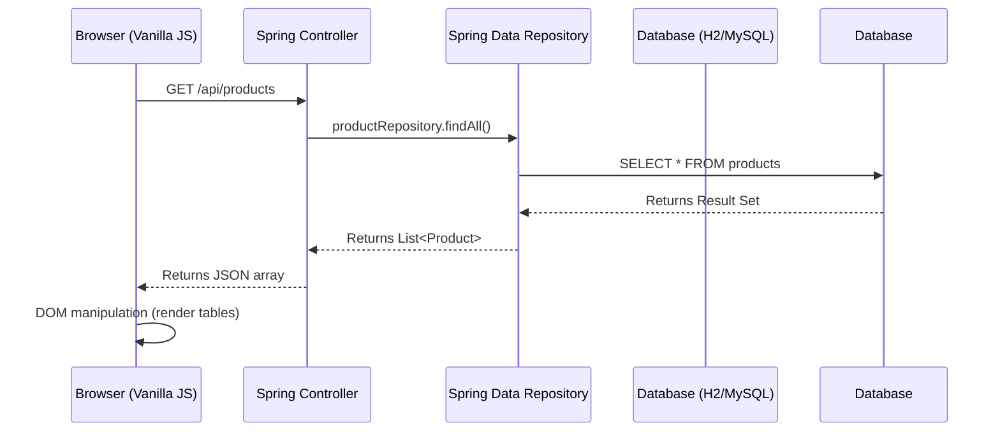
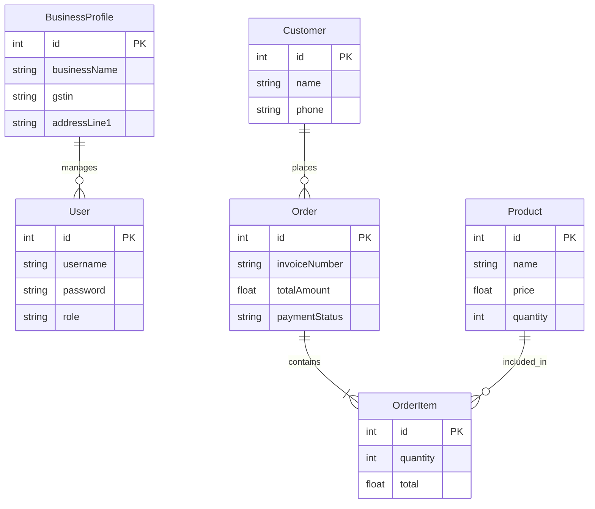

# BillingSystem Pro - Complete Project Documentation & Academic Report

## 1. Project Overview

### Project Name
**BillingSystem Pro**

### Purpose of the Project
BillingSystem Pro is a modern, web-based invoice and inventory management system designed to streamline the billing process for small to medium-sized businesses (SMBs). It provides a centralized platform to manage products, customers, billing, and business profiles, eliminating the need for manual record-keeping and standalone legacy software.

### Main Objectives
- **Automate Billing**: Generate professional, GST-compliant invoices quickly.
- **Inventory Tracking**: Monitor stock levels in real-time to prevent stockouts.
- **Customer Management**: Maintain a database of customers for better relationship management and recurring sales tracking.
- **Business Identity**: Allow businesses to register and manage their unique profiles (GSTIN, Address, Branding).
- **Data Security**: Secure the system with role-based authentication (Admin/Staff) and encrypted passwords.

### Problem Statement
Many small businesses still rely on paper-based ledgers or complex, outdated desktop software for billing. This leads to human error, lost data, difficulty in tracking inventory, and delays in generating GST reports. There is a need for a lightweight, accessible, and intuitive web application that handles these operations seamlessly.

### Real-World Use Case
A local restaurant or retail store can use BillingSystem Pro at their checkout counter. The cashier logs in, selects items from the real-time inventory using the smart autocomplete search, applies the correct GST, and generates an invoice. The business owner can log in from the dashboard to view daily revenue, active stock, and monthly performance.

### Key Features Implemented
- **Login & Registration System**: Secure authentication with Bcrypt password hashing.
- **Billing Management**: Interactive dual-pane billing interface with dynamic cart calculations.
- **Product & Inventory Management**: CRUD operations for stock, including unit types and GST percentages.
- **Smart Product Search**: Portal-based autocomplete search dropdown that fetches products dynamically and displays stock levels.
- **Customer Handling**: Add and manage customer details linked to their invoices.
- **Dashboard & Analytics**: KPI cards showing real-time metrics (Today's Revenue, Total Bills, Active Products).
- **Business Profile Management**: Dynamic company details integrated into the application's topbar and invoice generation.

---

## 2. Complete Tech Stack Explanation

### 2.1 Backend Technologies
- **Java (JDK 21/25)**: The core programming language used. Selected for its robust ecosystem, strong object-oriented features, and enterprise-grade reliability.
- **Spring Boot (v3.2.5)**: The backend framework. It simplifies Java application development by providing auto-configuration, an embedded server, and production-ready defaults. Used to build REST APIs and handle HTTP requests.
- **Spring Data JPA & Hibernate**: Object-Relational Mapping (ORM) tools. Used to map Java classes (`@Entity`) directly to database tables, eliminating the need to write raw SQL queries for basic CRUD operations.
- **Spring Security**: Secures the application by handling login sessions, intercepting unauthorized requests, and managing Bcrypt password hashing.
- **H2 Database (Development) / MySQL (Production)**: The relational database used to store all business data. H2 is used in memory for rapid development and testing, while MySQL/TiDB is configured via `application-prod.properties` for online deployment.

### 2.2 Frontend Technologies
- **HTML5**: Defines the structure of the web pages (e.g., `index.html`, `login.html`).
- **CSS3 (Vanilla)**: Used for complete styling without heavy frameworks. Features modern CSS concepts like CSS Variables (`--primary`), Flexbox, CSS Grid, and Glassmorphism for a premium look.
- **Vanilla JavaScript (ES6+)**: Handles all client-side logic. Makes asynchronous API calls using the `fetch` API, manages DOM updates dynamically without reloading the page (Single Page Application feel), and handles user interactions.

### 2.3 Build & Deployment Tools
- **Maven**: The dependency management and build automation tool. It downloads all required Java libraries (like Spring Web, Spring Security) and packages the application into a runnable `.jar` file.
- **Git & GitHub**: Version control system to track code changes and collaborate.
- **Embedded Tomcat Server**: Spring Boot comes with Tomcat embedded. It runs the application on port `8080` without needing external server configuration.

---

## 3. Complete Java Explanation (Core OOP & Architecture)

### 3.1 Core Java & OOP Concepts Used

#### Classes & Objects
Everything in the backend is structured as classes. For example, the `Product` class serves as a blueprint, and when a new product is saved, an *object* (instance) of that class is created and persisted to the database.

#### Encapsulation
Encapsulation is the practice of keeping fields private and providing public getter and setter methods.
*Example in Project*: In `User.java`, fields like `private String password;` are hidden. They can only be accessed via `getPassword()` and modified via `setPassword()`. This protects the integrity of the data.

#### Inheritance
Inheritance allows a class to inherit properties/methods from another class or interface.
*Example in Project*: `public interface UserRepository extends JpaRepository<User, Long>`. Here, our custom repository inherits powerful database methods like `save()`, `findAll()`, and `deleteById()` from Spring's `JpaRepository`.

#### Polymorphism
Polymorphism allows objects to be treated as instances of their parent class rather than their actual class.
*Example in Project*: Method Overriding. The `DataInitializer` class implements `CommandLineRunner`. We use the `@Override` annotation to provide a specific implementation of the `run(String... args)` method to seed demo data.

#### Access Modifiers
- `private`: Used for entity fields and injected dependencies in controllers.
- `public`: Used for REST API methods (`@GetMapping`, `@PostMapping`) so they can be accessed externally.
- `final`: Used for dependency injection (`private final UserRepository userRepository;`) ensuring the dependency cannot be changed once the object is constructed.

#### Collections Framework
Used extensively to group objects.
*Example in Project*: `List<Product>` is returned by the `ApiController` to send all products to the frontend. `List<OrderItem>` is used inside the `Order` entity to map a one-to-many relationship.

#### Exception Handling
Ensures the application doesn't crash on bad inputs.
*Example in Project*: In `ApiController.java`, we use `@ExceptionHandler(IllegalArgumentException.class)` to catch validation errors and return a clean HTTP 400 Bad Request with a JSON error message instead of a generic server crash.

### 3.2 Backend Architecture (MVC/API Flow)

The project follows a standard **Controller-Service-Repository** layered architecture:

1. **Entity Layer (`com.billing.model`)**: Contains Java classes mapped to database tables (e.g., `User`, `Product`, `Order`).
2. **Repository Layer (`com.billing.repository`)**: Interfaces extending `JpaRepository` that handle direct database communication.
3. **Controller Layer (`com.billing.controller`)**: 
   - `ApiController.java`: A `@RestController` that handles JSON requests from the JavaScript frontend (AJAX).
   - `RegistrationController.java`: A standard `@Controller` that handles traditional HTML form submissions for the registration page.
4. **Configuration Layer (`com.billing.config`)**: Contains `SecurityConfig` (manages authentication rules) and `DataInitializer` (seeds dummy data).

### 3.3 Database Connectivity & ORM
Java connects to the database using Spring Data JPA (Hibernate).
- **ORM Usage**: Instead of writing `INSERT INTO products...`, we simply call `productRepository.save(newProduct)`. Hibernate translates this Java object into a SQL query automatically.
- **Entity Relationships**: In the `Order` class, we use `@OneToMany(cascade = CascadeType.ALL)` to map `OrderItem` entities. If an order is saved, its associated items are automatically saved in the database.

### 3.4 Authentication Flow
1. User visits `/login`.
2. Spring Security intercepts the request.
3. User submits credentials. Spring Security consults the database via `UserRepository`.
4. The entered password is hashed using `BCryptPasswordEncoder` and compared against the hash stored in the database.
5. If valid, a server-side Session is created, and an authentication cookie (`JSESSIONID`) is sent to the browser.
6. The user is redirected to `/index.html`.

---

## 4. Folder Structure Explanation

```text
C:/Users/rajpr/.gemini/antigravity/scratch/BillingSystemWeb/
├── pom.xml                     # Maven configuration, lists all dependencies
├── render.yaml                 # Configuration for online cloud deployment
├── src/
│   ├── main/
│   │   ├── java/com/billing/   # ALL JAVA BACKEND CODE LIES HERE
│   │   │   ├── BillingApplication.java  # Main execution class (Spring Boot Entry Point)
│   │   │   ├── config/         # Setup files (Security, Data Initializer)
│   │   │   ├── controller/     # API Endpoints (Receives frontend requests)
│   │   │   ├── model/          # Database Entities (User, Product, Order)
│   │   │   └── repository/     # Database Interfaces (JPA connections)
│   │   └── resources/
│   │       ├── application.properties   # Database credentials, server port config
│   │       ├── static/                  # ALL FRONTEND CODE LIES HERE
│   │       │   ├── css/app.css          # Styling for the dashboard
│   │       │   ├── js/app.js            # JavaScript logic, API fetch calls
│   │       │   ├── index.html           # Main Dashboard/Application UI
│   │       │   ├── login.html           # Login screen UI
│   │       │   └── register.html        # Business Registration screen UI
```

---

## 5. Development Process Timeline

1. **Initial Foundation**: The project started by setting up Spring Boot, configuring the H2 database, and defining the JPA entities (`Product`, `Order`, `Customer`).
2. **REST API Construction**: Built `ApiController` to allow basic CRUD operations.
3. **Frontend Integration**: Developed a sleek, dark-themed UI in `index.html` with vanilla JS (`app.js`). Replaced static HTML tables with dynamic data fetched from the API.
4. **Security Implementation**: Added Spring Security to restrict access. Created the `/login` page and `User` entities. Added Bcrypt for password security.
5. **Business Identity Module**: Added the `BusinessProfile` entity. Modified the API to fetch live company names to display in the UI's topbar. Added a `Profile` page for users to view details and change passwords securely.
6. **UI/UX Polish & Bug Fixes**: 
   - Fixed CSS stacking context (`z-index`) issues where the autocomplete dropdown was getting cut off by using a `<body>` portal approach.
   - Refined the billing layout for better responsiveness.
   - Fixed login UI bugs (persistent error messages, broken registration flow).

---

## 6. Current State & Pending Improvements

### Current Resolved Issues
- ✅ Fixed persistent "Invalid Credentials" message on the login page (added auto-dismiss JS).
- ✅ Removed hardcoded demo credentials from the login screen.
- ✅ Fixed the "Register your business" button flow by clearing old business profiles dynamically.
- ✅ Fixed product autocomplete dropdown getting hidden behind other UI containers.

### Pending Features / Future Improvements
- **PDF Generation**: Implement the backend logic to generate a downloadable PDF invoice using a library like `iText` or `Apache PDFBox`.
- **Advanced Reporting**: Add graphical charts (Chart.js) to the Dashboard/Reports page.
- **Multi-tenant Scaling**: Adapt the database architecture to support multiple distinct businesses logging into the same deployed instance (currently optimized for single-business deployment).
- **Forgot Password Flow**: Implement email OTP verification for password resets.

---

## 7. Deployment & Running Instructions

### Project Location
The exact path of the project on this system is:
`C:\Users\rajpr\.gemini\antigravity\scratch\BillingSystemWeb`

### How to Run Locally
1. **Prerequisites**: Ensure Java (JDK 21 or 25) and Maven are installed.
2. **Open Terminal** and navigate to the project directory:
   ```bash
   cd C:\Users\rajpr\.gemini\antigravity\scratch\BillingSystemWeb
   ```
3. **Build the Application**:
   ```bash
   mvn clean package -DskipTests
   ```
4. **Run the Server**:
   ```bash
   java -jar target/BillingSystemWeb-1.0.0.jar --spring.profiles.active=dev
   ```
5. **Access the App**: Open a web browser and go to `http://localhost:8080`.
6. **Login**: Register a new business or log in using the credentials you created.

---

## 8. Architecture & Data Flow Diagrams

### 8.1 Request Flow Architecture (Mermaid)


### 8.2 Database Entity Relationship Diagram (ERD)

