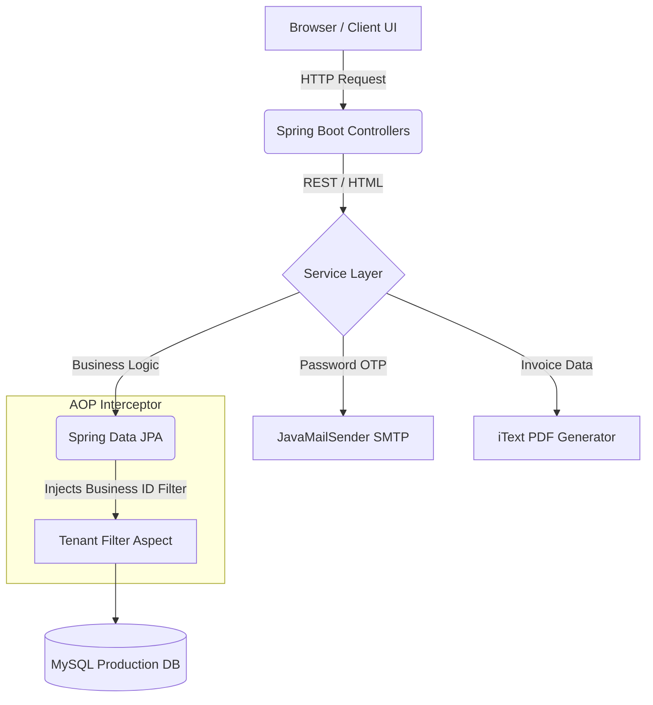

<div align="center">

<a href="https://billing-system-pro-p3kp.onrender.com" target="_blank">
  
</a>

**An Enterprise-Grade Multi-Tenant Billing and Invoice Management System built with Java Spring Boot.**

[](https://www.oracle.com/java/)
[](https://spring.io/projects/spring-boot)
[](https://www.mysql.com/)
[](https://billing-system-pro-p3kp.onrender.com)
<br>
[](LICENSE)
[](https://github.com/rajpriyanshu148/BillingSystemWeb/stargazers)
[](https://github.com/rajpriyanshu148/BillingSystemWeb/network/members)

🟢 **[Live Production Demo](https://billing-system-pro-p3kp.onrender.com)** • 📄 **[Swagger API Docs](https://billing-system-pro-p3kp.onrender.com/swagger-ui.html)**


</div>

<br>

## 🚀 Project Overview

**BillingSystem Pro** is a robust, production-ready SaaS simulation designed to handle the core operational needs of multiple businesses from a single deployed instance. It utilizes a strict **multi-tenant architecture** to securely isolate data between different companies, allowing them to manage inventory, generate highly customized PDF invoices, and analyze dashboard metrics securely.

Whether acting as a Point-of-Sale (POS) system for retail or an invoice generator for B2B distributors, this system streamlines complex, manual billing workflows into a beautiful, centralized web application.

---

## ✨ Key Features

| Feature | Description |
| :--- | :--- |
| 🏢 **Multi-Tenancy** | Database-level data isolation using Hibernate `@Filter` AOP. Business A cannot see Business B's data. |
| 📄 **Dynamic PDF Invoices** | Automatically generate and download perfectly formatted PDF bills using **iText 7**. |
| 🔐 **Secure Authentication** | Role-Based Access Control (Admin/Staff) and a secure OTP-based Forgot Password recovery flow. |
| 📦 **Inventory Management** | Add, edit, and track products with dynamic multi-tier GST support (5%, 12%, 18%, 28%). |
| 📈 **Dashboard Analytics** | Real-time tracking of Daily Revenue, Monthly Trends, and automated low-stock warnings. |
| 👥 **Customer CRM** | Maintain records of regular customers alongside walk-in buyer tracking. |
| 📚 **Swagger Integration** | Fully annotated, interactive OpenAPI documentation accessible via `/swagger-ui.html`. |
| ⚡ **SPA-Like Frontend** | Lightning-fast Vanilla JavaScript UI utilizing asynchronous fetch for dynamic DOM manipulation. |

---

## 🏗️ System Architecture

The project adheres to a strict MVC and layered Service-Repository architecture, heavily relying on Aspect-Oriented Programming (AOP) for data security.



---

## 💻 Technology Stack

### Backend & Core
* **Java 21:** LTS Release providing optimal performance and modern syntax.
* **Spring Boot 3.2.5:** Rapid application development framework.
* **Spring Data JPA / Hibernate:** Object-Relational Mapping.

### Database
* **MySQL 8.0:** Primary production database hosted on Render.
* **H2 Database:** In-memory, zero-config database for fast local development testing.

### Security & Integrations
* **Spring Security:** Session-based authentication and Role-Based Access Control (RBAC).
* **BCrypt:** Secure, salted password hashing.
* **Spring Boot Starter Mail:** SMTP integration for OTP generation.
* **iText 7:** Advanced PDF rendering engine.

### Frontend
* **Vanilla HTML5 & CSS3:** Semantic markup with custom Glassmorphism/Dark UI components.
* **Vanilla JavaScript (ES6+):** Async/Await API interactions without heavy JS frameworks.

---

## 🛡️ Security Features

Enterprise-grade software requires robust security paradigms. This project implements:

1. **Tenant Data Isolation:** Enforced deeply at the Hibernate Session level. Even raw `repository.findAll()` queries are intercepted and forced to apply `WHERE business_id = X`.
2. **OTP Recovery:** Mitigates account lockouts securely by emailing 6-digit expiring One-Time Passwords.
3. **Session Management:** Spring Security handles active sessions, preventing unauthenticated routing.
4. **Input Validation:** Backend `@Valid` checks paired with required DOM attributes to sanitize inputs.
5. **CSRF & XSS Protection:** Managed internally by Spring Security and careful frontend encoding.

---

## 📸 Application Previews

<div align="center">

*Note: Replace these placeholders with actual screenshots from your project.*

| **Login & OTP Flow** | **Admin Dashboard** |
|:---:|:---:|
|  |  |
| **Interactive POS Billing** | **Generated PDF Invoice** |
|  |  |

</div>

---

## 📖 API Documentation Examples

Full API visibility is accessible at `/swagger-ui.html`. Below are quick snippets of core operations:

<details>
<summary><b>1. Generate New Bill (POST /api/bills/generate)</b></summary>

```json
{
  "customerId": 5,
  "items": [
    {
      "productId": 102,
      "quantity": 3,
      "price": 150.00
    }
  ],
  "paymentMethod": "CASH"
}
```
</details>

<details>
<summary><b>2. Request Password OTP (POST /api/auth/forgot-password)</b></summary>

```json
{
  "username": "admin"
}
```
*Response:*
```json
{
  "success": true,
  "message": "OTP sent to registered email address."
}
```
</details>

---

## 🛠️ Installation & Setup

Follow these instructions to deploy BillingSystem Pro on your local machine.

### 1. Clone the Repository
```bash
git clone https://github.com/rajpriyanshu148/BillingSystemWeb.git
cd BillingSystemWeb
```

### 2. Configure Environment (Optional MySQL)
By default, the application runs perfectly out-of-the-box using the **H2 In-Memory Database**. 
To switch to MySQL for production, open `src/main/resources/application-prod.properties`:
```properties
DATABASE_URL=jdbc:mysql://localhost:3306/billing_system
DATABASE_USERNAME=root
DATABASE_PASSWORD=your_secure_password
```

**SMTP Configuration (For OTPs):**
Edit `application.properties` to enable email functionality:
```properties
spring.mail.host=smtp.gmail.com
spring.mail.port=587
spring.mail.username=your_email@gmail.com
spring.mail.password=your_app_password
```

### 3. Build & Run
Ensure Maven is installed, then execute:
```bash
# Build the project
./mvnw clean install

# Run with Default H2 Database
./mvnw spring-boot:run

# Run with Production MySQL Profile
./mvnw spring-boot:run -Dspring-boot.run.profiles=prod
```

The application will be live at `http://localhost:8080`.

---

## 📂 Folder Structure

<details>
<summary>Click to expand</summary>

```text
BillingSystemWeb/
├── src/main/java/com/billing/
│   ├── config/          # Spring Security, OpenAPI, Tenant AOP, Data Initializer
│   ├── controller/      # REST Endpoints (ApiController, AuthController)
│   ├── model/           # JPA Entities (BusinessProfile, Product, Order)
│   ├── repository/      # Spring Data JPA Interfaces
│   └── service/         # Core Business Logic & PDF Generation
├── src/main/resources/
│   ├── static/          # CSS, JS, HTML Views
│   ├── application.properties       # H2 & SMTP Config
│   └── application-prod.properties  # MySQL Production Config
└── pom.xml              # Maven Dependencies
```
</details>

---

## 🌩️ Deployment

This project is actively configured for seamless deployment on **Render**.
* **Database:** Connected to a managed Render MySQL instance.
* **Environment Variables:** Credentials (`DATABASE_URL`, etc.) are injected directly into the Render dashboard to keep secrets out of source control.
* **Build Command:** `mvn clean package -DskipTests`
* **Start Command:** `java -jar target/billing-system-1.0.0.jar --spring.profiles.active=prod`

---

## 🔮 Future Enterprise Improvements
To scale this into a multi-million user platform, the following upgrades are planned:
- [ ] **Dockerization:** Containerizing the application for Kubernetes orchestration.
- [ ] **Redis Caching:** Implementing distributed caching for rapid Dashboard loading.
- [ ] **Payment Gateways:** Integrating Stripe/Razorpay for direct B2B invoice payments.
- [ ] **AWS S3 Storage:** Offloading generated PDF invoices to cloud object storage.
- [ ] **WebSockets:** Real-time push notifications for low inventory alerts.

---

## 🤝 Contributing
Contributions are welcome! Please feel free to submit a Pull Request. For major changes, please open an issue first to discuss what you would like to change.

1. Fork the Project
2. Create your Feature Branch (`git checkout -b feature/AmazingFeature`)
3. Commit your Changes (`git commit -m 'Add some AmazingFeature'`)
4. Push to the Branch (`git push origin feature/AmazingFeature`)
5. Open a Pull Request

---

## 📜 License
Distributed under the MIT License. See `LICENSE` for more information.

---

<div align="center">
  <b>Developed with ❤️ by <a href="https://github.com/rajpriyanshu148">Priyanshu Raj</a></b>
</div>
